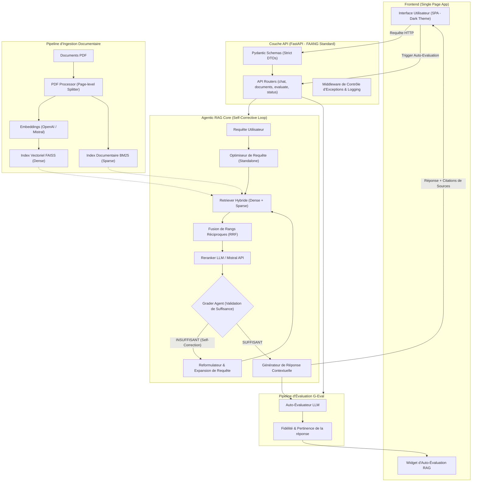

# 🧠 AG Knowledge Assistant – Agentic & Hybrid RAG System

[](https://fastapi.tiangolo.com)
[](https://github.com/langchain-ai/langchain)
[](https://github.com/facebookresearch/faiss)
[](https://www.docker.com)

Assistant intelligent de questions-réponses sur documents PDF, conçu selon les standards d'architecture logicielle des entreprises FAANG. Ce projet intègre une **recherche hybride avancée (dense/sparse)**, un algorithme de **fusion de rangs réciproques (RRF)**, un **reranker LLM/API**, et un pipeline de traitement autonome de type **Agentic Self-Correcting RAG (CRAG)** avec **auto-évaluation** en temps réel.

---

## 🏛️ Architecture Système (End-to-End)

Le diagramme ci-dessous illustre le flux complet des données, depuis le chargement des PDF jusqu'au cycle autonome de validation de l'agent RAG et de calcul des métriques de qualité.



---

## 💎 Points Forts de la Conception Logicielle (Production-Grade)

### 1. Refactorisation FAANG (Modulaire & Standardisée)
Le dépôt a été entièrement structuré pour séparer strictement les préoccupations logicielles, selon un découpage inspiré des bibliothèques phares comme LangChain ou les SDK officiels de Google/OpenAI :
*   **`backend/app/core/`** : Point d'ancrage des configurations (`config.py`), de la centralisation des logs système (`logging.py`) et des filtres globaux d'exceptions et d'erreurs (`exceptions.py`).
*   **`backend/app/api/`** : Couche d'exposition REST organisée avec routeurs FastAPI découplés (`routes/`) et validation stricte des entrées/sorties via des modèles Pydantic V2 faisant office de Data Transfer Objects (`schemas/`).
*   **`backend/app/services/`** : Logique métier compartimentée en sous-packages isolés par domaine :
    *   `document_processors/` : Extraction du texte PDF page par page et découpage adaptatif.
    *   `vectorstores/` : Enceinte de communication et de sauvegarde locale des bases vectorielles FAISS.
    *   `retrievers/` : Algorithmes de recherche hybride multicritères.
    *   `agents/` : Moteur de boucle de raisonnement et de self-correction.
    *   `evaluation/` : Module d'audit LLM des réponses générées.

### 2. Recherche Hybride Multicritères & Fusion RRF
Pour résoudre le problème de l'absence de correspondance par mot-clé des bases de données vectorielles pures, le système déploie un moteur de recherche hybride :
*   **Retrieval Dense** : Similarité cosinus sur embeddings sémantiques (OpenAI `text-embedding-3-small` / Mistral `mistral-embed`) calculés localement ou par API via FAISS.
*   **Retrieval Sparse** : Score statistique par fréquence de termes via l'implémentation de l'algorithme de pointe **BM25 (Best Matching 25)**.
*   **Reciprocal Rank Fusion (RRF)** : Fusion mathématique non paramétrique des résultats de recherche. Les documents sont reclassés en fonction de la somme de l'inverse de leurs rangs respectifs dans chaque algorithme de recherche ($Score = \sum \frac{1}{60 + rang}$), garantissant un alignement sémantique et textuel parfait.

### 3. Reranker à Double Moteur (LLM & Mistral Native API)
Avant d'être envoyés à l'agent de génération, les chunks issus de la fusion RRF subissent une étape de filtrage de granularité fine :
*   **Mistral Rerank API** : Utilisation native du modèle `mistral-rerank-latest` pour ordonner précisément les documents selon leur pertinence thématique.
*   **Reranker LLM Prompt-Based (Fallback)** : En cas d'indisponibilité ou si OpenAI est sélectionné, un micro-modèle LLM évalue chaque chunk candidat sous format JSON afin de conserver uniquement le top-k le plus pertinent, maximisant la densité d'information dans la fenêtre de contexte.

### 4. Agentic Self-Correcting RAG
Inspiré des papiers scientifiques sur le RAG correctif (*Corrective RAG*), le système utilise une boucle autonome d'évaluation et de rétroaction :
1.  **Optimisation standalone** : Rephrasage de la requête initiale en une question autonome basée sur l'historique conversationnel de la session.
2.  **Premier passage de recherche** : Collecte des documents via le module hybride + Rerank.
3.  **Audit de suffisance (Grader Agent)** : Un agent LLM spécialisé inspecte les sources récupérées et détermine si elles contiennent suffisamment de faits pour répondre de manière fiable.
4.  **Self-Correction / Expansion de requête** : Si le grader évalue le contexte comme insuffisant, le système génère automatiquement une nouvelle formulation de requête basée sur le manque identifié, relance la recherche et fusionne les résultats.
5.  **Génération transparente** : Si le contexte reste insuffisant après expansion, l'assistant génère une réponse basée sur ses connaissances générales tout en notifiant explicitement l'utilisateur du manque de preuves dans les documents importés, éliminant ainsi les hallucinations.

---

## 🛠️ Stack Technique

*   **Backend Framework** : FastAPI (Asynchrone, typage statique Python)
*   **IA & Orchestration** : LangChain Core, LangChain Community, Pydantic V2
*   **Modèles de Langage** : OpenAI (GPT-4o-mini) & Mistral AI (Mistral Large, Mistral Rerank)
*   **Base Vectorielle** : FAISS-CPU (indexation en mémoire hautement performante sur CPU)
*   **Recherche Sparse** : BM25 Okapi (via rank_bm25)
*   **Frontend** : HTML5, Vanilla JavaScript, Vanilla CSS (Glassmorphism & animations de transition)
*   **Conteneurisation** : Docker, Docker Compose (volume persistant pour les index)

---

## ⚙️ Installation & Lancement Rapide

### Option 1 : Déploiement Local (Python)

#### 1. Cloner et préparer l'environnement virtuel
```bash
git clone https://github.com/dfilali/ai-rag-knowledge-assistant.git
cd ai-rag-knowledge-assistant
python3 -m venv .venv
source .venv/bin/activate
```

#### 2. Installer les dépendances
```bash
pip install -r backend/requirements.txt
```

#### 3. Configurer l'environnement
Copiez le fichier d'exemple et renseignez vos clés API :
```bash
cp .env.example .env
```

#### 4. Lancer le serveur FastAPI
```bash
uvicorn backend.app.main:app --reload --host 127.0.0.1 --port 8000
```
L'interface est accessible sur [http://127.0.0.1:8000](http://127.0.0.1:8000).

---

### Option 2 : Lancement en un clic avec Docker (Recommandé)

Docker automatise la compilation des bibliothèques système complexes requises pour OpenMP (utilisées par FAISS). Le répertoire `./data` local est monté en volume persistant pour sauvegarder vos documents et index FAISS lors des redémarrages.

```bash
docker compose up --build
```
Accédez directement à l'application via [http://localhost:8000](http://localhost:8000).

---

## 📊 Endpoints API & Schémas

La documentation interactive complète de l'API (Swagger UI) est disponible sur `/docs`.

*   `GET /api/status` : Renvoie l'état de configuration des clés API sur le serveur.
*   `POST /api/upload` : Reçoit un fichier PDF multipart, exécute le découpage et alimente l'index FAISS + BM25.
*   `POST /api/chat` : Point d'accès de l'Agentic RAG. Reçoit la requête utilisateur et le `session_id`.
*   `GET /api/documents` : Liste les documents indexés dans la base avec leurs métadonnées (taille, date).
*   `DELETE /api/documents/{filename}` : Supprime un document physique et reconstruit automatiquement l'index hybride.
*   `POST /api/evaluate` : Analyse par LLM de la fidélité (*faithfulness*) et de la pertinence (*relevance*) de la réponse générée.
*   `POST /api/clear-history` : Réinitialise l'historique conversationnel de la session active.
